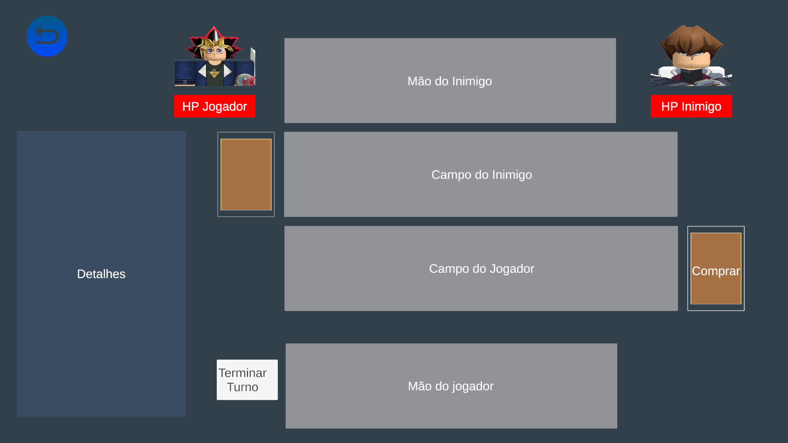

<h1> Prototype Game Card</h1>
<h2> Jogo desenvolvido para aprimormento técnico em desenvolvimento de jogos em Unity</h2>
<h3> O projeto envolve conhecimentos como:</h3>
<ul>
  <li>Padrão Singleton</li>
  <li>Padrão Observer</li>
  <li>Banco de Dados</li>
  <li>C#</li>
  <li>Canvas e manipulação de UI</li>
  <li>Controle de eventos</li>
</ul>

<h2>Como jogar</h2>
<h3> O Jogo foi fortemente inspirado em Yu-gi-oh</h3>

<h3> As regras são as seguintes</h3>
<ul>
  <li>O jogador só pode comprar uma carta por turno</li>
  <li>O jogador pode invocar cartas em seu turno</li>
  <li>No primeiro turno o jogador não pode atacar</li>
  <li>Cada carta só pode atacar uma vez por turno</li>
  <li> Quando uma carta é selecionada para atacar o jogador deve selecionar a carta que será atacada</li>
  <li>Se não houver cartas no campo do inimigo ele receberá um ataque direto</li>
  <li>Se a carta atacada tiver ataque menor que a carta atacante ela será destruída</li>
  <li>A diferença entre os pontos de ataque será deduzida dos pontos de vida do oponente</li>
  <li>Após clicar em "encerrar turno" o inimigo fará suas jogadas e encerrará seu turno</li>
</ul>

<h3> O jogo está disponível para download <a href="https://drive.google.com/drive/folders/1ufoFCI7P5YoClvbhW5Ah4N86cqq3QY_K?hl=pt-br">aqui</a></h3>
